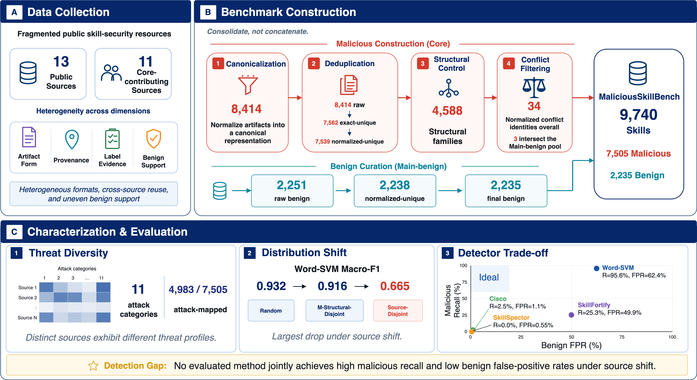
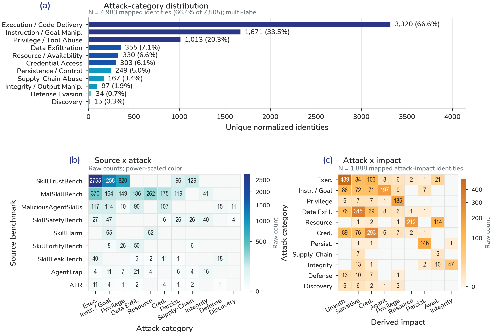

# MaliciousSkillBench

**A Comprehensive Benchmark for Malicious Agent Skill Detection**

[Paper](#paper) · [Dataset](https://huggingface.co/datasets/ProtectSkills/MaliciousSkillBench) · [GitHub](https://github.com/protectskills/MaliciousSkillBench) · [Project page](docs/)

The public paper URL is not yet assigned. The Hugging Face dataset is at [ProtectSkills/MaliciousSkillBench](https://huggingface.co/datasets/ProtectSkills/MaliciousSkillBench).

## Overview

Existing malicious Agent Skill resources are fragmented across sources, artifact formats, provenance conventions, label evidence, and benign support.

MaliciousSkillBench consolidates rather than merely concatenating these resources. Construction applies canonicalization, exact and normalized deduplication, structural grouping, cross-label conflict handling, and benchmark-specific evaluation protocols, while preserving source provenance.

The resulting benchmark supports threat characterization and controlled detection evaluation under random, structural-disjoint, and source-disjoint protocols.

## Benchmark at a Glance

| Measure | Count |
|---|---:|
| Public sources | 13 |
| Core-contributing sources | 11 |
| Benchmark identities | 9,740 |
| Malicious | 7,505 |
| Benign | 2,235 |
| Structural families | 4,588 |
| Harmonized attack categories | 11 |
| Attack-mapped malicious identities | 4,983 / 7,505 |

The public dataset represents all 9,740 identities. Exact frozen Skill text is available for 9,735 records (7,500 malicious and 2,235 benign). Five malicious records provide sanitized public representations; the exact original text of those records remains withheld.

## Benchmark Construction



Figure 1 is the benchmark overview. The construction motto is **consolidate, not concatenate**.

Core malicious construction:

- 8,414 raw malicious artifacts
- 7,562 exact-unique identities
- 7,539 normalized-unique identities
- 4,588 structural families
- 34 normalized cross-label conflict identities overall

Main-benign curation:

- 2,251 raw benign artifacts
- 2,238 normalized-unique identities
- 2,235 final benign identities

Final benchmark: **7,505 malicious + 2,235 benign = 9,740**.

## Threat Landscape



Figure 2 is the quantitative threat landscape. Harmonized attack mapping covers **4,983 / 7,505** malicious identities across **11** categories. The mapping is multi-label and partial; it is not complete attack annotation coverage.

Derived harmonized impacts cover **2,128 / 7,505** malicious identities. These are derived mappings, not source-provided or ground-truth impact labels. The attack × impact intersection is **1,888 / 7,505**.

The miniature source × attack matrix in Figure 1 is schematic. Use Figure 2 for quantitative source × attack and attack × impact views.

## Dataset Access

Hugging Face is the primary dataset distribution platform. This GitHub repository is the code, documentation, and reproducibility hub; it does not duplicate full Skill text.

Dataset: [https://huggingface.co/datasets/ProtectSkills/MaliciousSkillBench](https://huggingface.co/datasets/ProtectSkills/MaliciousSkillBench)

The default `primary` configuration can be loaded with:

```python
from datasets import load_dataset

ds = load_dataset(
    "ProtectSkills/MaliciousSkillBench",
    "primary",
    split="train",
)

def get_public_text(row):
    return row["skill_text"] or row["public_skill_text"]
```

Exact frozen `skill_text` is available for 9,735 identities. For five malicious records containing sensitive credential material, `skill_text` is null and `public_skill_text` provides a sanitized representation. Do not treat those five sanitized texts as the paper's exact experimental inputs.

Named protocol manifests:

```python
splits = load_dataset("ProtectSkills/MaliciousSkillBench", "splits")
```

Local metadata for inspection and protocol reproduction:

- [`metadata/benchmark_manifest.csv`](metadata/benchmark_manifest.csv) — identity, label, provenance, hashes, taxonomy codes, and frozen split membership
- [`metadata/source_registry.csv`](metadata/source_registry.csv)
- [`metadata/structural_families.csv`](metadata/structural_families.csv)
- [`metadata/splits/`](metadata/splits/)

## Evaluation Protocols

Use the frozen split manifests in [`metadata/splits/`](metadata/splits/). Do not regenerate partitions.

| Protocol | Train / validation / test |
|---|---|
| Random | 6,818 / 974 / 1,948 |
| Source-Balanced Random | 6,817 / 973 / 1,950 |
| Malicious-Structural-Disjoint | 6,818 / 974 / 1,948 |
| Source-Disjoint | 7,513 / 835 / 1,384 |

Source-Disjoint holds out `SRC009`, `SRC011`, and `SRC012`. Its test set contains 839 malicious and 545 benign identities. The Source-Disjoint manifest also retains 8 frozen `excluded` identities for exact protocol accounting.

Structural-disjoint and source-disjoint evaluation test whether detectors rely on near-duplicate structure or source-specific cues. Source-disjoint results describe source-conditioned shift; they are not a claim of universal out-of-distribution generalization.

See [`benchmark/protocols.md`](benchmark/protocols.md) for protocol definitions. The frozen benchmark retains 4,588 structural-family identifiers. After conservative cross-label exclusion, 4,575 of these identifiers are represented by at least one final primary malicious identity; 13 retained family IDs have no final primary member.

## Baselines

The released baseline scripts evaluate text-only learned detectors on the frozen protocols:

- Word TF-IDF + logistic regression
- Word TF-IDF + linear SVM
- Char TF-IDF + linear SVM

See [`baselines/`](baselines/) and [`evaluation/`](evaluation/). The scripts read Skill text as inert data and do not execute Skills.

## Detection Findings

Headline learned detector: **Word TF-IDF + linear SVM** (Word-SVM), Macro-F1:

| Protocol | Macro-F1 |
|---|---:|
| Random | 0.932 |
| Malicious-Structural-Disjoint | 0.916 |
| Source-Disjoint | 0.665 |

Under Source-Disjoint evaluation, Word-SVM retains 95.6% malicious recall but reaches a 62.4% benign false-positive rate. Cross-source learned-detector degradation is dominated by benign over-flagging while malicious recall remains high.

## Off-the-Shelf Scanners

Source-Disjoint operating points:

| Method | Macro-F1 | Malicious recall | Benign FPR |
|---|---:|---:|---:|
| Cisco-local-behavioral | 0.308 | 2.5% | 1.1% |
| SkillFortify-offline | 0.349 | 25.3% | 49.9% |
| SkillSpector-static | 0.281 | 0.0% | 0.55% |

Different methods occupy different false-positive / false-negative regimes. No evaluated method jointly achieves high malicious recall and low benign false-positive rates under source shift. Low FPR for Cisco-local-behavioral and SkillSpector-static occurs alongside very low recall.

SkillSpector-static is a static / no-LLM configuration and is not the LLM-backed SkillSpector setup used in some external work. Cisco-local-behavioral was run in a local compatibility environment; see [`scanner_eval/README.md`](scanner_eval/README.md).

ColluSkill reports adversarial attack-evasion success rates (ASR). This scanner experiment reports binary malicious/benign detection. ASR and Macro-F1 are not equivalent metrics.

## Getting Started

Validate the GitHub metadata package:

```bash
python evaluation/validate_dataset.py
```

Inspect protocol sizes and metric helpers:

```bash
python evaluation/validate_dataset.py --help
python -c "from evaluation.metrics import macro_f1, malicious_recall, benign_fpr; print('ok')"
```

Run a baseline after obtaining the Hugging Face text tables from `ProtectSkills/MaliciousSkillBench`. The CLI below is supported by the public script:

```bash
python baselines/run_baselines.py --help
```

Do not execute untrusted Skills, follow embedded destinations, or install companion packages from benchmark text.

## Paper

**MaliciousSkillBench: A Comprehensive Benchmark for Malicious Agent Skill Detection**

Yue Wang, Yi Liu, Gelei Deng, Ying Zhang, Yuekang Li, Zhenyu Chen, and Leo Zhang.

The public paper URL is not yet assigned.

## Citation

```bibtex
@unpublished{wang2026maliciousskillbench,
  title={MaliciousSkillBench: A Comprehensive Benchmark for Malicious Agent Skill Detection},
  author={Wang, Yue and Liu, Yi and Deng, Gelei and Zhang, Ying and Li, Yuekang and Chen, Zhenyu and Zhang, Leo},
  note={Unpublished manuscript. Publication venue and persistent identifier to be added.},
  year={2026}
}
```

See [`CITATION.cff`](CITATION.cff). This entry does not claim an arXiv identifier, DOI, or conference acceptance.

## Responsible Use

The benchmark contains malicious or adversarial Skill instructions for defensive research and evaluation. See [`RESPONSIBLE_USE.md`](RESPONSIBLE_USE.md) and [`SECURITY.md`](SECURITY.md).

## License

Code released as part of MaliciousSkillBench is licensed under the Apache License 2.0.

Benchmark metadata, derived annotations, taxonomy mappings, and split manifests produced by this project are released under CC BY 4.0 unless otherwise noted.

Third-party Skill artifacts retain their respective upstream terms and are not relicensed by MaliciousSkillBench.

See [`LICENSE`](LICENSE), [`LICENSE-DATA`](LICENSE-DATA), and [`THIRD_PARTY_NOTICE.md`](THIRD_PARTY_NOTICE.md).

## Acknowledgments

We thank the authors of the 13 public sources registered in [`metadata/source_registry.csv`](metadata/source_registry.csv) for releasing the research artifacts that this benchmark consolidates.

## Documentation

- [`benchmark/schema.md`](benchmark/schema.md)
- [`benchmark/sources.md`](benchmark/sources.md)
- [`benchmark/taxonomy.md`](benchmark/taxonomy.md)
- [`benchmark/protocols.md`](benchmark/protocols.md)
- [`baselines/README.md`](baselines/README.md)
- [`scanner_eval/README.md`](scanner_eval/README.md)
- [`docs/`](docs/) — project page source
